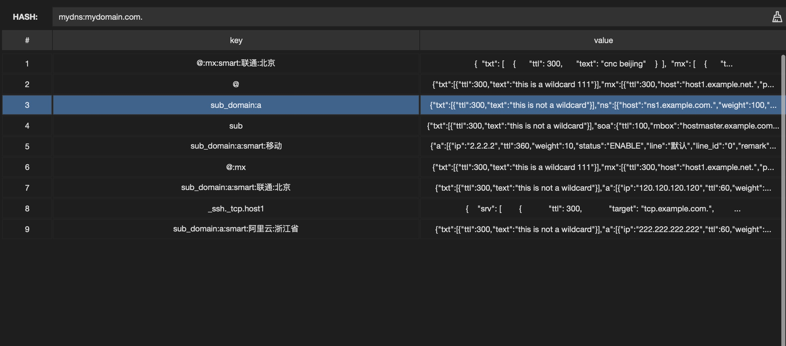
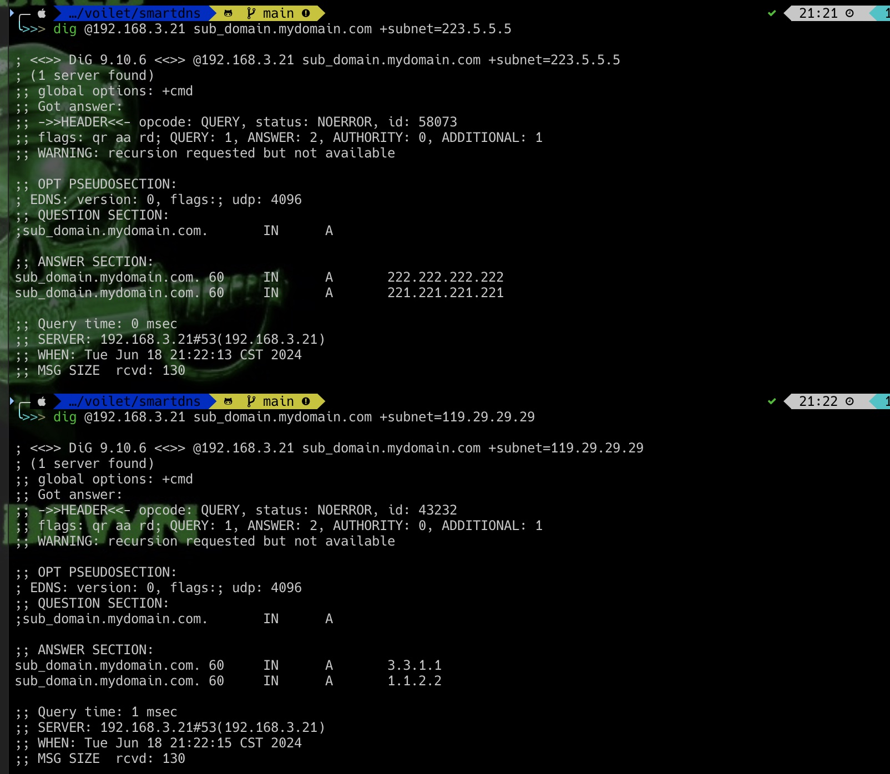
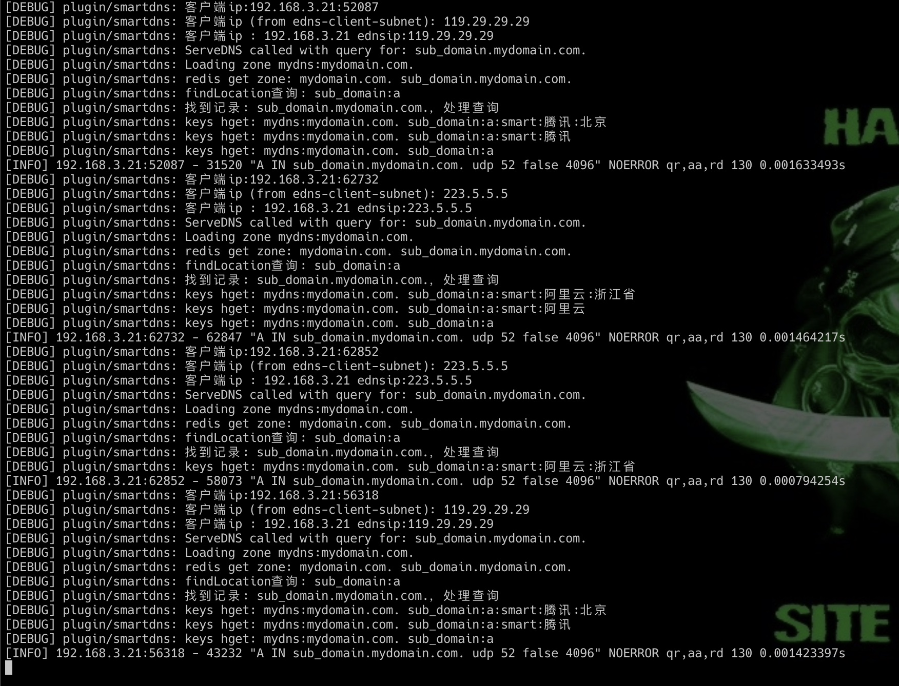

# 基于coredns External Plugins redis插件修改

* 基于https://coredns.io/explugins/redis/ 进行修改，本次支持EDNS查询解析功能
* 支持按运营商，省份进行调度
* 基于https://github.com/lionsoul2014/ip2region/tree/master/binding/golang IP库进行查询解析
* 主要数据结构如下
  
* 使用方法 下载coredns源码，修改plugin.cfg文件 在最后一行增加smartdns:github.com/voilet/smartdns 修改后使用make编译即可
* 使用方法 在corefile中增加smartdns插件即可，和redis插件一样使用，多增加一个ipdbpath参数 指定ip2region xdb数据库路径

## syntax

~~~
smartdns
~~~

redis loads authoritative zones from redis server

Address will default to local redis server (localhost:6379)
~~~
smartdns {
    address ADDR
    password PWD
    prefix PREFIX
    suffix SUFFIX
    connect_timeout TIMEOUT
    read_timeout TIMEOUT
    ttl TTL
    ipdbpath /smartcdn/ip2region.xdb
}
~~~

* `address` is redis server address to connect in the form of *host:port* or *ip:port*.
* `password` is redis server *auth* key
* `connect_timeout` time in ms to wait for redis server to connect
* `read_timeout` time in ms to wait for redis server to respond
* `ttl` default ttl for dns records, 300 if not provided
* `prefix` add PREFIX to all redis keys
* `suffix` add SUFFIX to all redis keys

## examples

~~~ corefile
. {
    redis example.com {
        address localhost:6379
        password foobared
        connect_timeout 100
        read_timeout 100
        ttl 360
        prefix _dns:
    }
}
~~~

## reverse zones

reverse zones is not supported yet

## proxy

proxy is not supported yet

## zone format in redis db

### zones

each zone is stored in redis as a hash map with *zone* as key

~~~
redis-cli>KEYS *
1) "example.com."
2) "example.net."
redis-cli>
~~~

### dns RRs

dns RRs are stored in redis as json strings inside a hash map using address as field key.
*@* is used for zone's own RR values.

#### A

~~~json
{
  "a":[{
    "ip" : "1.2.3.4",
    "ttl" : 360
  }]
}
~~~

#### AAAA

~~~json
{
  "aaaa":[{
    "ip" : "::1",
    "ttl" : 360
  }]
}
~~~

#### CNAME

~~~json
{
  "cname":[{
    "host" : "x.example.com.",
    "ttl" : 360
  }]
}
~~~

#### TXT

~~~json
{
  "txt":[{
    "text" : "this is a text",
    "ttl" : 360
  }]
}
~~~

#### NS

~~~json
{
  "ns":[{
    "host" : "ns1.example.com.",
    "ttl" : 360
  }]
}
~~~

#### MX

~~~json
{
  "mx":[{
    "host" : "mx1.example.com",
    "priority" : 10,
    "ttl" : 360
  }]
}
~~~

#### SRV

~~~json
{
  "srv":[{
    "host" : "sip.example.com.",
    "port" : 555,
    "priority" : 10,
    "weight" : 100,
    "ttl" : 360
  }]
}
~~~

#### SOA

~~~json
{
  "soa":[{
    "ttl" : 100,
    "mbox" : "hostmaster.example.com.",
    "ns" : "ns1.example.com.",
    "refresh" : 44,
    "retry" : 55,
    "expire" : 66
  }]
}
~~~

#### CAA

~~~json
{
  "caa":[{
    "flag" : 0,
    "tag" : "issue",
    "value" : "letsencrypt.org"
  }]
}
~~~

#### example

~~~
$ORIGIN example.net.
 example.net.                 300 IN  SOA   <SOA RDATA>
 example.net.                 300     NS    ns1.example.net.
 example.net.                 300     NS    ns2.example.net.
 *.example.net.               300     TXT   "this is a wildcard"
 *.example.net.               300     MX    10 host1.example.net.
 sub.*.example.net.           300     TXT   "this is not a wildcard"
 host1.example.net.           300     A     5.5.5.5
 _ssh.tcp.host1.example.net.  300     SRV   <SRV RDATA>
 _ssh.tcp.host2.example.net.  300     SRV   <SRV RDATA>
 subdel.example.net.          300     NS    ns1.subdel.example.net.
 subdel.example.net.          300     NS    ns2.subdel.example.net.
 host2.example.net                    CAA   0 issue "letsencrypt.org"
~~~

above zone data should be stored at redis as follow:

~~~
1)  "@"
2)  "{"txt":[{"ttl":300,"text":"this is a wildcard 111"}],"mx":[{"ttl":300,"host":"host1.example.net.","preference":10}]}"
3)  "@:mx"
4)  "{"txt":[{"ttl":300,"text":"this is a wildcard 111"}],"mx":[{"ttl":300,"host":"host1.example.net.","preference":10},{"ttl":300,"host":"host2.example.net.","preference":10}]}"
5)  "sub_domain:a:smart:移动"
6)  "{"a":[{"ip":"2.2.2.2","ttl":360,"weight":10,"status":"ENABLE","line":"默认","line_id":"0","remark":""},{"ip":"3.3.3.3","ttl":360,"weight":10,"status":"ENABLE","line":"默认","line_id":"0","remark":""}]}"
7)  "sub_domain:a"
8)  "{"txt":[{"ttl":300,"text":"this is not a wildcard"}],"ns":[{"host":"ns1.example.com.","weight":100,"ttl":360},{"host":"ns2.example.com.","weight":100,"ttl":360}],"srv":[{"host":"sip.example.com.","port":555,"priority":10,"weight":100,"ttl":360}],"caa":[{"flag":0,"tag":"issue","weight":100,"value":"letsencrypt.org"}],"cname":[{"host":"x.example.com.","weight":100,"ttl":360}],"aaaa":[{"ip":"::1","weight":100,"ttl":360}],"a":[{"ip":"1.1.2.2","ttl":60,"weight":10,"status":"ENABLE","line":"默认","line_id":"0","remark":""},{"ip":"3.3.1.1","ttl":60,"weight":10,"status":"ENABLE","line":"默认","line_id":"0","remark":""}]}"
9)  "sub_domain:a:smart:阿里云:浙江省"
10) "{"txt":[{"ttl":300,"text":"this is not a wildcard"}],"a":[{"ip":"222.222.222.222","ttl":60,"weight":10,"status":"ENABLE","line":"默认","line_id":"0","remark":""},{"ip":"221.221.221.221","ttl":60,"weight":10,"status":"ENABLE","line":"默认","line_id":"0","remark":""}]}"
11) "@:mx:smart:联通:北京"
12) "{
  "txt": [
    {
      "ttl": 300,
      "text": "cnc beijing"
    }
  ],
  "mx": [
    {
      "ttl": 300,
      "host": "cnc1.example.net.",
      "preference": 10
    },
{
      "ttl": 300,
      "host": "cnc2.example.net.",
      "preference": 10
    }
  ]
}"
13) "sub"
14) "{"txt":[{"ttl":300,"text":"this is not a wildcard"}],"soa":{"ttl":100,"mbox":"hostmaster.example.com.","ns":"ns1.example.com.","refresh":44,"retry":55,"expire":66}}"
15) "_ssh._tcp.host1"
16) "{
    "srv": [
        {
            "ttl": 300,
            "target": "tcp.example.com.",
            "port": 123,
            "priority": 10,
            "weight": 100
        }
    ]
}"
17) "sub_domain:a:smart:联通:北京"
18) "{"txt":[{"ttl":300,"text":"this is not a wildcard"}],"a":[{"ip":"120.120.120.120","ttl":60,"weight":10,"status":"ENABLE","line":"默认","line_id":"0","remark":""},{"ip":"221.221.221.221","ttl":60,"weight":10,"status":"ENABLE","line":"默认","line_id":"0","remark":""}]}"
~~~

## 演示

